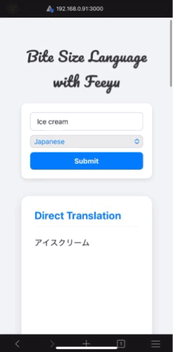

# Generative Contextual Language Learning App #
The app leverages generative AI (Large Language Models) to dynamically create highly contextualized, bite-sized learning materials based on minimal user input.



## Design ##
  ```mermaid
  graph LR
    A[User Device] -->|Keyword or simple phrase in home language| B(Generative Context Engine)
    B --> |Prompt|C(LLM e.g. OpenRouter)
    B <---|JSON| C
    A <---|Flashcards of contextual contents in foreign language| B
  ```

## Tech Stack ##
- Node
- Python
- Flask
- LangChain
- OpenRouter


## Tasks ##
- [x] MVP UI
- [x] Generative LLM integration
- [x] Private deployment
- [ ] Sufficient tests
- [ ] Continuous scrolling
- [ ] TTS engine
- [ ] Database
- [ ] Spaced repetition


